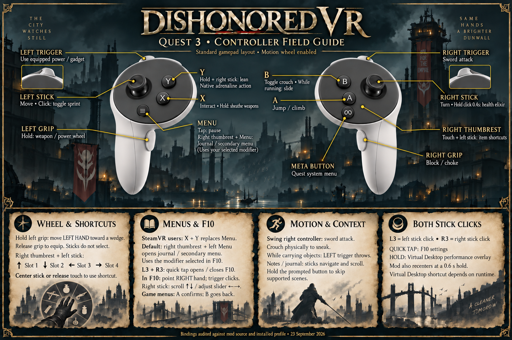

# Dishonored VR

Dishonored VR puts the Steam version of Dishonored (2012) into a PC VR headset. The game
renders in real stereo with full head and position tracking, and you play it with tracked
hands. You swing the sword by swinging the controller, aim Blink and the crossbow with your
hand, crouch by crouching, and read your health and mana off your wrists.

It runs on Quest headsets through Virtual Desktop, on SteamVR headsets such as the Index and
Vive, and on any headset whose runtime offers 32-bit OpenXR.

**Version 1.0.1.** The hotfix corrects FOV feedback, adds launcher updates and GOG
support, and improves support-log collection. See [release notes](docs/RELEASE_NOTES.md).

[Download the latest release](https://github.com/VR-Stereo-Hub/Dishonored-VR/releases) ·
[Support development on Ko-fi](https://ko-fi.com/pizzzaparker)

## Support the mod

If you're enjoying the mod and feeling generous, you can
[support it on Ko-fi](https://ko-fi.com/pizzzaparker). Thank you, it genuinely helps.
Every donation goes toward the AI bills that make this work possible and into further
development of this mod and the ones after it. Donating is never expected, and the mod
will always be free.

## Features

This is what 1.0.0 contains, gathered from the project's issue tracker. Almost everything
that can be switched or tuned has a control in the F10 panel.

### Seeing the world

- Real stereo. The game draws its scene once for each eye, from that eye's position, and
  each image reaches the headset with the head pose it was drawn for. That's why head
  turns stay steady, with no ghosting or judder.
- Full six-degree head tracking. Leaning and peeking around corners move your view in the
  game.
- Physical crouching keeps the camera at your real eye height. Looking up and down, and
  rolling your head, don't swing the camera around a fake neck, standing or crouched.
- The field of view matches your headset, and the world is at a natural scale.
- The game's camera shake and head bob are off by default: the walking bob, weapon kick,
  landing dips, and the jolts from hits and explosions. The view moves only when you do.
  Each kind can be turned back on in F10.
- Rain, blood and the low-health vignette are drawn at a comfortable depth instead of
  flat against your eyes. The close sheet of rain can be hidden completely.
- Menus, loading screens and books appear on a flat screen in front of you, and each new
  menu opens where you're looking. Dialogue scenes keep head look.
- Possession of rats, fish and people stays in stereo.
- Animation-driven camera motion, such as the sway after climbing a chain, stops when the
  animation does, so the camera never drifts away from your body.
- Render quality from 50% to 200% of the tested size, changed live in F10 or set in the
  launcher.

### Hands and weapons

- Your hands are tracked. The game's arms are cut at the wrist, so you see floating hands
  instead of stretched arms. The cut ends are rounded, and sleeve presets set where the
  cut falls.
- The sword, pistol and crossbow sit in your hands. The unmodelled side of the pistol and
  crossbow is filled in with a mirrored copy, so they look whole from any angle.
- Hand and weapon size are adjusted separately. Each hand has its own position adjustment,
  and the left hand has one more for casting powers.
- For full-body moves such as takedowns, choke holds and climbing, the game's own
  animation takes the hands back, then returns them to your controllers when the move
  ends.
- Power effects follow your drawn hands: the Heart's glow, Blink's hand effect and
  Possession's effect.

### Aiming

- What you fire goes along the ray you see. The crosshair, the laser beam and the shot all
  come from one ray.
- The pistol and crossbow aim down their own barrels, measured from the weapon model.
- Blink, Possession, Devouring Swarm and Windblast are aimed with your hand.
- Each item can use head aim or hand aim.
- The reticle can be resized, moved nearer or further, and recolored. It stays visible
  behind the F10 panel.

### Combat and movement

- The motion sword attacks the moment you swing, and the game still picks the attack
  animation. The swing speed needed is adjustable, and the log counts near misses so the
  threshold can be tuned to your arm.
- The sword's swing trail is hidden, because it follows the game's animation and not your
  blade.
- The stealth kill works by gesture: stab from behind.
- Drop takedowns from above are timed for you. An attack you press a moment before the game
  has found the guard below is held until it has, so the drop kill plays instead of an
  ordinary slash.
- Carried objects are thrown along your hand's aim with the left trigger.
- Every walking direction moves at the same speed. A full push on a diagonal no longer
  drops you to a walk.
- Sprint toggles on the left stick click, and B slides from a run.

### HUD

- Every HUD element has its own anchor. It can be off, part of the game frame, on a window
  in front of you, on a window fixed in the world, or on either hand.
- Health and mana sit on the backs of your hands, split across both wrists.
- Objective markers, interaction prompts, the sneak indicator and enemy awareness markers
  stay upright and stay over what they mark.
- The weapon wheel is a dial in the world that you select from with your hand.
- Notes and the journal attach to your hand at a readable angle.

### Comfort and performance

- The headset shows each frame with the head pose it was drawn for, which fixed the judder
  and ghosting on head turns.
- Diagnostics that cost frames ship turned off.
- The desktop mirror is off by default to save GPU time. If SteamVR crashes on startup, turn the mirror on and retry.

## Contents

- [Features](#features)
- [What you need](#what-you-need)
- [Installing](#installing)
- [The launcher](#the-launcher)
- [Headset settings](#headset-settings)
- [Controls](#controls)
- [The F10 panel](#the-f10-panel)
- [Tips](#tips)
- [Known issues](#known-issues)
- [Reporting a problem](#reporting-a-problem)
- [Credits](#credits)
- [Building from source](#building-from-source)
- [License](#license)

## What you need

- Dishonored on Steam (app 205100). The GOG and Epic versions use a different exe and are
  not supported.
- A 64-bit Windows PC that runs the game comfortably on a monitor. The mod renders two
  eyes at headset resolution, so a GPU with 8 GB of video memory or more is a good
  starting point.
- One of these headset setups:
  - Quest 2, 3 or Pro with [Virtual Desktop](https://www.vrdesktop.net/), using its
    OpenXR runtime (VDXR). This is the most tested path.
  - A SteamVR headset (Index, Vive, Pimax, or Windows Mixed Reality through SteamVR). The
    mod ships a small bridge, `dvr_steamvr32.dll`, that talks to SteamVR for it.
  - Any other headset whose OpenXR runtime has a 32-bit build.
- The DirectX shader compiler (`d3dcompiler_47.dll`). Windows Update installs it on almost
  every PC, and the launcher warns you if it's missing.

## Installing

### With the launcher (recommended)

1. Download `DishonoredVR-Launcher-v1.0.1.exe` from the
   [releases page](https://github.com/VR-Stereo-Hub/Dishonored-VR/releases).
2. Run it. It finds Dishonored in your Steam library on its own. If it can't, press
   `Change...` and point it at the game folder.
3. Pick your headset and render quality (see [the launcher](#the-launcher)). If you're
   unsure, keep the defaults, "Let the mod choose" and Balanced.
4. Press Install.
5. Press `Launch via Steam`, or start Dishonored from Steam as usual.

If the game has never been run on this PC, the launcher waits for its first run and then
applies the four game settings the mod needs.

Everything the mod needs is inside the exe, so there's nothing to unzip. To update later,
download the new launcher and press Update. You can run it again at any time to change
settings, turn VR off or uninstall.

### By hand, from the zip

1. Copy `d3d9.dll`, `dvr_steamvr32.dll` and `openvr_api.dll` into
   `<Steam library>\steamapps\common\Dishonored\Binaries\Win32\`. If an older release left
   a `dxvk_d3d9.dll` there, delete it.
2. Copy `dishonored_vr.ini` into the same folder.
3. Run the game once so it creates its config folder. Then run
   `setup-game-ini.ps1 -VRBaseline` from the zip, which turns off smoothed frame rate, depth
   of field, vsync and mouse smoothing in the game's own ini files.
4. If you want to pin a headset runtime, run `Switch VR Runtime.cmd` from the zip.
   Otherwise the mod picks one.
5. Launch through Steam.

To uninstall by hand, delete the three DLLs and `dishonored_vr.ini`. If the launcher
replaced another `d3d9.dll` when it installed, that file is kept as `d3d9.dll.dvr-backup`;
rename it back.

## The launcher

`DishonoredVR-Launcher-v1.0.1.exe` installs, configures and launches the mod. It uses the same
Dishonored-styled look as the in-game F10 panel.

### First-time setup

| Option | What it does | Default |
|---|---|---|
| Headset | "Quest via Virtual Desktop" uses Virtual Desktop's OpenXR runtime. "SteamVR headset" uses the bundled SteamVR bridge (start SteamVR first). "Let the mod choose" uses whichever 32-bit OpenXR runtime Windows has registered and falls back to the SteamVR bridge. | Let the mod choose |
| Render quality | Performance (2382x2468 per eye, 75% of Balanced's pixels), Balanced (2750x2850, the tested size) or Quality (3012x3122, 120%). | Balanced |
| Advanced: exact size | A slider from 50% to 200% of Balanced's pixel count. It's the same slider as the F10 Display tab. | Off |
| Desktop mirror | Shows the game on your monitor while you play. Leaving it off saves GPU time. If SteamVR crashes on startup, turn it on and retry. | Off |
| Physical crouching | Crouching in real life crouches in the game. | On |
| Hide close rain | Hides the sheet of rain drawn right in front of your eyes. Rain in the sky and splashes on the ground stay. | Off |
| Controller shortcuts | Picks which control turns the left stick into the item-shortcut D-pad (right thumbrest, left thumbrest or right stick click), and whether X+Y also opens the pause menu. | Right thumbrest, X+Y on |

The launcher also sets the four game settings the mod depends on, and it backs up every
file before changing it.

### After installing

Once the mod is installed, the launcher opens on your install and offers these:

- `Launch via Steam` starts the game through Steam. Always launch this way, because
  starting `Dishonored.exe` directly can crash the game at the main menu.
- `Update` installs the build this launcher carries. Your `dishonored_vr.ini` and F10
  settings are kept. If you'd rather start fresh, a toggle has the update replace them with
  the new release's defaults.
- `Change settings` reopens the setup choices, filled in with your current values.
- `Bindings` shows the controller layout picture with zoom and scrolling, and lists your
  current shortcut settings above it.
- `Collect logs` zips the mod's logs, your settings and some system details into a
  `DishonoredVR Support` folder on your desktop, ready to attach to a bug report.
- `Desktop shortcut` and `Start menu shortcut` add a shortcut to the launcher.
- `Disable VR` leaves the mod installed but inactive, so the game runs flat. `Enable VR`
  turns it back on.
- `Uninstall` removes the mod and restores any `d3d9.dll` it replaced. Deleting your
  `dishonored_vr.ini` too is optional, and off unless you tick it.
- `About` shows the version, a link to the releases page, the credits and the Ko-fi link.

The launcher covers the big choices. Fine tuning happens in the F10 panel in game.

### Command line

The launcher can also run unattended, for scripted setups:

```
DishonoredVR-Launcher-v1.0.1.exe --apply --op install --game-dir "<game folder>" --runtime auto --quality balanced
```

`--op` takes `install`, `update`, `change`, `baseline`, `disable`, `enable` or `uninstall`.
`--runtime` takes `vdxr`, `steamvr` or `auto`. `--quality` takes `performance`, `balanced`,
`quality` or `custom`, where `custom` needs `--percent <n>` or `--size <W>x<H>`. The exit
code is 0 on success, 2 when a step failed and 3 when access was denied.
`docs/INSTALLER.md` lists every option and every file the launcher writes.

## Headset settings

Set your headset to 120 Hz. With the Virtual Desktop beta, 144 Hz works as well. The mod
was tuned at these rates. If your PC can't hold 120, lower the render quality first, then
drop to 90 Hz.

With a Quest and Virtual Desktop, choose VDXR as the OpenXR runtime in Virtual Desktop's
settings. The launcher detects it and pins it for the mod.

With a SteamVR headset, start SteamVR before the game. The mod uses its bundled bridge, and
the desktop mirror defaults off. If SteamVR crashes on startup, turn it on and retry.

Other runtimes work through "Let the mod choose" as long as they have a 32-bit OpenXR
build. SteamVR's own native 32-bit OpenXR currently shows the image upside down, so SteamVR
users should stay on the bundled bridge (see [known issues](#known-issues)).

## Controls



This picture is the complete layout, checked against the mod's source. The launcher's
Bindings page and the F10 Layout tab show the same picture with zoom. The controllers act
as a gamepad with motion controls on top, and other controllers have the same actions in
the same places.

| Input | Action |
|---|---|
| Left stick | Move. Click to toggle sprint. |
| Right stick | Turn. Hold the click for 0.4 s to drink a health elixir. |
| Left trigger | Use the equipped power or gadget. |
| Right trigger | Sword attack. |
| Left grip (hold) | Open the weapon and power wheel. Move your left hand toward a wedge and let go to equip it. The sticks don't select. |
| Right grip | Block, and choke when you're behind someone. |
| A | Jump and climb. |
| B | Toggle crouch. Slide while running. |
| X | Interact. Hold to sheathe your weapons. |
| Y | Hold with the right stick to lean. Y is also the game's adrenaline action. |
| Menu (left controller) | Tap to pause. Right thumbrest plus Menu opens the journal. |
| Right thumbrest + left stick | Item shortcuts. Up, down, left and right are slots 1 to 4. Center the stick or lift your thumb to use the item. |
| Both stick clicks, tap | Open or close the F10 panel. |
| Both stick clicks, hold 0.6 s | Recenter. On a Quest the same hold also opens Virtual Desktop's performance overlay. |
| X + Y | Pause, for controllers with no Menu button under SteamVR. You can turn this off. |

Motion controls:

- Swing the right controller to attack with the sword. A quick stab into an unaware guard
  from behind performs the stealth kill.
- Crouch in real life to sneak.
- While you carry a bottle, a rock or another movable object, the left trigger throws it
  along your hand's aim.
- Point your hand to aim Blink, your other powers, the crossbow, the pistol and grenades.
- Notes and the journal appear in your hand, and the sticks turn pages and scroll.
- In scenes that can be skipped, hold the prompted button to skip.

In menus, A confirms and B goes back. In the F10 panel, point with your right hand and
pull the trigger to click. The right stick scrolls up and down, and pushing it left or right
nudges the slider you're pointing at.

On a keyboard, F5 recenters and F10 opens the panel.

## The F10 panel

Press F10, or tap both stick clicks, to open the settings panel in the headset. Point with
your right hand and pull the trigger to click. Changes save as you make them.

The panel has three levels. Basic holds what most players want, Advanced adds the tuning,
and Debug holds the diagnostics. Its tabs cover the display (render quality, field of view,
fullscreen and vsync), the controls (the motion sword, camera shake, drop takedowns and
item shortcuts), hands and weapons, aim per item, the HUD anchors and the reticle. The
Layout tab shows the controller picture, with a zoom button and a way to see the whole
picture at once.

Every setting is also in `dishonored_vr.ini` beside the game, with a comment above each
key.

## Tips

- Recenter after you sit down or stand up: hold both stick clicks, or press F5.
- Quit through the game's menu. Closing the window can leave `Dishonored.exe` running in
  the background, which blocks the next launch until you end it in Task Manager.
- If the image looks blurry, raise the render quality. Keep fullscreen on.

## Known issues

- SteamVR's native 32-bit OpenXR shows the image upside down. The bundled SteamVR bridge
  ("SteamVR headset" in the launcher) works normally.
- After dying, the image can shrink to a small square until the next load.
- A spring razor placed very close to you can be invisible. It still works and can be
  picked up.
- Starting `Dishonored.exe` directly, instead of through Steam, can crash at the main menu.
- Capture tools that hook OpenXR, such as OpenXR-OBSMirror, can't record the game. Their
  capture layer is 64-bit only and the game is 32-bit. Record your runtime's own mirror
  instead, such as SteamVR's "Display VR View" or Virtual Desktop's recorder.
- The desktop window shows one eye, which is nearly square, so it has black bars on a 16:9
  monitor. Crop them in your recording software.

The full list, with the state of each issue, is in `docs/KNOWN_ISSUES.md`, and fixes for
specific errors are in `docs/TROUBLESHOOTING.md`.

## Reporting a problem

1. Open the launcher and press `Collect logs`. It saves a zip to a `DishonoredVR Support`
   folder on your desktop.
2. Open an issue on the
   [issue tracker](https://github.com/VR-Stereo-Hub/Dishonored-VR/issues) and attach the
   zip.
3. Say what you were doing when it went wrong, and roughly when. The log is timestamped.

If you'd like to look at the logs yourself:

- `dishonored_vr.log` sits beside `Dishonored.exe`. The previous run is kept as
  `dishonored_vr.prev.log`, and only one previous run is kept, so copy it out before
  launching again.
- `dishonored_vr_crash.txt`, beside the exe, appears if the game crashed.
- `%LOCALAPPDATA%\DishonoredVR\` holds the launcher's log and crash dumps.

## Credits

- **Pizza Parker** ([BioVRDev](https://github.com/BioVRDev)): development and maintenance.
- **VOID** ([mohamad-balouza](https://github.com/mohamad-balouza)): development and maintenance.
- **Gingas** ([GingasVRFO](https://github.com/GingasVRFO)): the original Dishonored VR mod,
  up to alpha 38.92. This project continues her work with her permission.

Dishonored is made by Arkane Studios and published by Bethesda. This is a fan project and
includes no game files. The OpenXR runtime layer, the SteamVR bridge, the headset simulator
and much of the tooling come from the
[BioShock trilogy VR mod](https://github.com/VR-Stereo-Hub/bioshock-trilogy-vr).
Third-party libraries: Dear ImGui (MIT), the OpenXR SDK (Apache 2.0) and the OpenVR SDK
(BSD 3-clause). Their notices are in `THIRD_PARTY_NOTICES.md`.

If the mod has given you some good hours in Dunwall, a
[Ko-fi donation](https://ko-fi.com/pizzzaparker) is always appreciated. It goes into the AI
bills and the mods still to come.

## Building from source

You need Visual Studio 2022 or its Build Tools (with the C++ workload and the CMake
component) and Git. The mod is 32-bit, like the game.

```powershell
git clone --recursive https://github.com/VR-Stereo-Hub/Dishonored-VR.git
cd Dishonored-VR
.\tools\build.ps1 -Release      # the mod, the SteamVR bridge, the launcher and the test tools
.\tools\install.ps1 -Release    # copy the build into the game folder (found through Steam)
.\tools\package.ps1             # the release zip and the launcher, in dist\
```

`src/proxy` holds the `d3d9.dll` entry points, and `src/core` the game-independent VR core:
the frame path, stereo, the OpenXR runtime layer, input and the F10 panel.
`src/game/dishonored` holds everything that knows the game's engine. `src/tools` has the
launcher, the SteamVR bridge and a simulated OpenXR runtime for testing without a headset.
The `docs/` folder records the architecture, the engine notes and every investigation.
Contributors start at `CLAUDE.md` and `docs/STATUS.md`.

## License

zlib/libpng. See `LICENSE`.
