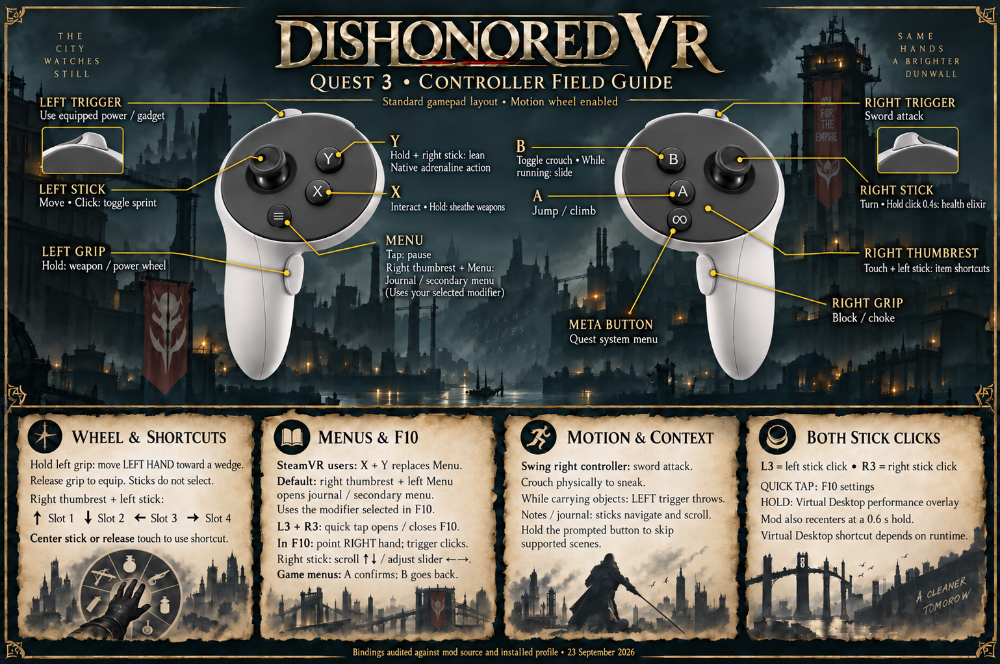

# Dishonored VR

Dishonored VR puts Dishonored (2012) into a PC VR headset. The game renders in real stereo
with full head and position tracking, and you play it with tracked arms. You swing the sword
by swinging the controller, aim Blink and the crossbow with your hand, grab loot and open
doors with your hands, crouch by crouching, and read your health and mana off your wrists.

It works with the **Steam and GOG** versions of the game, on Quest headsets through Virtual
Desktop, on SteamVR headsets such as the Index and Vive, and on any headset whose runtime
offers 32-bit OpenXR.

**Version 1.0.4.** Full-arm IK, grabbing with your hands, the spyglass, and the last of the
one-eye stutter fixed. See [what changed since 1.0.0](#whats-new-since-100) and the
[release notes](docs/RELEASE_NOTES.md).

[Download the latest release](https://github.com/VR-Stereo-Hub/Dishonored-VR/releases) |
[FAQ](docs/FAQ.md) |
[Support development on Ko-fi](https://ko-fi.com/pizzzaparker)

> **Having a problem?** Most questions are answered in the [FAQ](docs/FAQ.md). If yours
> isn't, open the launcher, press `Collect logs`, and attach the zip to a
> [bug report](#reporting-a-problem).

## Contents

- [What's new since 1.0.0](#whats-new-since-100)
- [Features](#features)
- [What you need](#what-you-need)
- [Installing](#installing)
- [The launcher](#the-launcher)
- [Headset settings](#headset-settings)
- [Recommended settings](#recommended-settings)
- [Controls](#controls)
- [The F10 panel](#the-f10-panel)
- [Optional add-ons](#optional-add-ons)
- [Tips](#tips)
- [Known issues](#known-issues)
- [Reporting a problem](#reporting-a-problem)
- [Support the mod](#support-the-mod)
- [Credits](#credits)
- [Building from source](#building-from-source)
- [License](#license)

## What's new since 1.0.0

1.0.0 was the first public release. Four updates followed in two weeks, most of them driven
by the logs players sent in.

**1.0.4: arms and hands.** Your whole arm now follows the controller, shoulder to fingers,
and fits your body in F10 > IK. Reach out and squeeze the grip to take loot, read notes, open
doors, pull levers and pick things up, each hand for itself. The Heart has a back. The mask's
spyglass works. Keyhole peeking looks through the keyhole. The HUD sits more central, crouch
is a toggle by default, and DLSS / FSR can be set in the launcher. Fixed: one eye stuttering
on slower GPUs, a rare sideways flicker, the view shrinking or going flat when a conversation
opens a shop, power effects sliding off the hand, and ReShade not starting.

**1.0.3: performance.** **Alternate Frame Warping (AFW)** renders one eye per frame and
rebuilds the other from depth, for up to roughly double the frame rate (opt-in, pair it with
DLSS or DLAA). The launcher gained a Mods section that installs ReShade, a texture-pack memory
option that stops large HD texture packs crashing the 32-bit game, and button mapping. Arms
and weapons now use the world's field of view, so they show at true size.

**1.0.2: image quality and controls.** DLAA, DLSS and AMD FSR as anti-aliasing, CAS
sharpening, cleaner textures at an angle, and resolution up to 300%. A reworked HUD that
stays where it belongs, snap turning, controller button remapping, and Index / Beyond /
Vive Pro 2 controller tuning. Fixed: objects vanishing from one eye, the view stuck in a
small box after dying, slide assist firing by accident (now off), cutscenes zooming oddly,
and the game process not closing on quit.

**1.0.1: hotfix.** Fixed the view gradually shrinking into a small square. The launcher
updates itself, supports GOG through Galaxy, refuses the unsupported 64-bit installs, and
collects logs from the last ten sessions in a zip small enough for Discord. The desktop
mirror defaults off, which is a large performance win.

## Features

Almost everything that can be switched or tuned has a control in the F10 panel.

### Seeing the world

- **Real stereo.** The game draws its scene once for each eye, from that eye's position,
  and each image reaches the headset with the head pose it was drawn for, so head turns stay
  steady without ghosting or judder. Each eye decides on its own what is hidden, so nothing
  pops out of one eye.
- **Alternate Frame Warping (AFW)**, an optional faster mode: one eye per frame, the other
  rebuilt from depth.
- **DLAA, DLSS and AMD FSR 4 / 3.1** as anti-aliasing, plus CAS sharpening, anisotropic
  filtering and smoothed texture detail. Resolution from 50% to 300%, changed live.
- Full six-degree head tracking. Lean and peek around corners for real, and look through
  keyholes.
- Physical crouching keeps the camera at your real eye height. Looking up, down or rolling
  your head doesn't swing the camera around a fake neck.
- The field of view matches your headset, and the world is at a natural scale.
- The game's camera shake and head bob are off by default: the walking bob, weapon kick,
  landing dips, and the jolts from hits and explosions. Each can come back in F10.
- Rain, blood and the low-health vignette sit at a comfortable depth. The close sheet of
  rain can be hidden.
- Menus, loading screens and books show on a flat screen, each opening where you look.
  Shops float in the world like the pause menu.
- Possessing rats, fish and people stays in stereo.

### Arms, hands and weapons

- **Full-arm IK.** Your arms follow your controllers from shoulder to fingers. Fit the
  shoulders and arm length to your body in F10 > IK, or turn it off for floating hands.
- **Grab with your hands.** Squeeze the grip near loot, books, notes, doors, levers and
  carryable objects. Each hand grabs for itself and opens as it gets close.
- The sword, pistol and crossbow sit in your hands and look whole from any angle.
- Hand and weapon size, and each hand's position, are adjustable.
- Takedowns, choke holds and climbing hand the arms to the game's animation, then give them
  back. The arms can be hidden during takedowns.
- Power effects follow your hands: the Heart's glow, Blink's hand effect and Possession's
  effect. The Heart has a modelled back.

### Aiming and combat

- What you fire goes along the ray you see: the crosshair, the laser and the shot share one
  ray, and the pistol and crossbow aim down their own barrels.
- Blink, Possession, Devouring Swarm, Windblast, the pistol, the crossbow and grenades go
  where your hand points. Any item can switch to head aim.
- The motion sword attacks the moment you swing. Stab an unaware guard from behind for the
  stealth kill. Drop takedowns from above are timed for you.
- The mask's spyglass: hold the right controller to your right eye and pull the trigger.
- Carried objects are thrown along your hand's aim with the left trigger.
- Every walking direction moves at the same speed. Snap turning is available.

### HUD

- Every HUD element has its own anchor: off, in the game frame, on a window in front of you,
  on a window fixed in the world, or on either hand.
- Health and mana sit on the backs of your wrists.
- Objective markers, prompts, the sneak indicator and enemy awareness markers stay upright
  over what they mark, and stay sharp with DLSS / FSR.
- The weapon wheel is a dial you pick from with your hand. Notes and the journal appear in
  your hand.
- The reticle can be resized, moved and recoloured. Subtitles have colour, outline and
  background options.

### The launcher

One exe installs the mod, sets up the game, picks your headset runtime, render quality,
rendering method and upscaler, maps your buttons, installs ReShade, launches through Steam or
GOG Galaxy, shows the controller layout, collects logs for bug reports, updates itself,
turns VR off or uninstalls.

## What you need

- **Dishonored on Steam (app 205100) or GOG.** Standard and Definitive editions both work.
  **The Epic Games Store and PC Game Pass versions do not work**: they are a different, 64-bit
  build of the game, and the launcher refuses them.
- A 64-bit Windows PC that runs the game comfortably on a monitor. Linux is not supported.
- One of these headset setups:
  - Quest 2, 3, 3S or Pro with [Virtual Desktop](https://www.vrdesktop.net/), using its
    OpenXR runtime (VDXR). This is the most tested path.
  - A SteamVR headset (Index, Vive, Pimax, Bigscreen Beyond, or Windows Mixed Reality
    through SteamVR). The mod ships a small bridge, `dvr_steamvr32.dll`, that talks to
    SteamVR for it. Quest over Link or Steam Link goes this way too.
  - Any other headset whose OpenXR runtime has a 32-bit build.
- The DirectX shader compiler (`d3dcompiler_47.dll`). Windows Update installs it on almost
  every PC, and the launcher warns you if it's missing.

## Installing

### With the launcher (recommended)

1. Download `DishonoredVR-Launcher-v1.0.4.exe` from the
   [releases page](https://github.com/VR-Stereo-Hub/Dishonored-VR/releases).
2. Run it. It finds Dishonored in your Steam or GOG library on its own. If it can't, point
   it at the game folder.
3. Pick your headset and render quality. If you're unsure, keep the defaults.
4. Press Install.
5. Press `Launch via Steam` (or `Launch via GOG`), or start the game from Steam or Galaxy as
   usual. Don't start `Dishonored.exe` directly.

If the game has never been run on this PC, the launcher waits for its first run and then
applies the game settings the mod needs. Everything the mod needs is inside the exe, so
there's nothing to unzip.

**Updating:** open the launcher and press `Update`; it checks for new releases on its own.
`Overwrite INI` (on by default) replaces your settings with the new tested defaults and keeps
a backup of the old file. Untick it to keep your own settings.

### By hand, from the zip

1. Copy `d3d9.dll`, `dvr_steamvr32.dll` and `openvr_api.dll` into the game's
   `Binaries\Win32\` folder (next to `Dishonored.exe`). If an older release left a
   `dxvk_d3d9.dll` there, delete it.
2. Copy `dishonored_vr.ini` into the same folder.
3. Run the game once so it creates its config folder. Then run
   `setup-game-ini.ps1 -VRBaseline` from the zip, which turns off smoothed frame rate, depth
   of field, vsync and mouse smoothing in the game's own ini files.
4. If you want to pin a headset runtime, run `Switch VR Runtime.cmd` from the zip.
   Otherwise the mod picks one.
5. Launch through Steam or Galaxy.

Copy every file. A missing DLL is the usual reason a manual install starts flat.

To uninstall by hand, delete the three DLLs and `dishonored_vr.ini`. If the launcher
replaced another `d3d9.dll` when it installed, that file is kept as `d3d9.dll.dvr-backup`;
rename it back.

## The launcher

`DishonoredVR-Launcher-v1.0.4.exe` installs, configures and launches the mod, in the same
Dishonored-styled look as the in-game F10 panel.

### Setup choices

| Option | What it does | Default |
|---|---|---|
| Headset | "Quest via Virtual Desktop" uses Virtual Desktop's OpenXR runtime. "SteamVR headset" uses the bundled SteamVR bridge (start SteamVR first). "Let the mod choose" uses whichever 32-bit OpenXR runtime Windows has registered and falls back to the bridge. Your headset model is recorded in bug reports, and Index, Beyond or Vive Pro 2 turns on the Index controller tuning. | Let the mod choose |
| Render quality | Performance (75% of the tested pixel count), Balanced (100%), Quality (120%) or Ultra (150%). An exact percentage is available under Advanced. | Balanced |
| Rendering method | Stereo draws both eyes every frame. AFW (experimental) draws one eye per frame and warps the other; use it with DLAA or DLSS. | Stereo |
| Upscaler | DLSS / DLAA (NVIDIA) or FSR (AMD), with quality and preset. Anti-aliasing, not extra frames. | Off |
| Texture pack compatibility | Lets large HD texture packs load without running the 32-bit game out of memory. | Off |
| Desktop mirror | Shows the game on your monitor. Leaving it off saves GPU time. If SteamVR crashes on startup, turn it on. | Off |
| Movement and comfort | Physical crouching, snap turning, the close rain overlay. | Physical crouch on |
| Controller shortcuts | Which control turns the left stick into the item-shortcut D-pad (right thumbrest, left thumbrest or right stick click), and whether X+Y opens the pause menu. | Right thumbrest, X+Y on |
| Button mapping | Remap the controller before you start, including swapping the move and turn sticks. | Game layout |

The launcher sets the game settings the mod depends on and backs up every file before
changing it.

### After installing

- `Launch via Steam` / `Launch via GOG` starts the game the safe way.
- `Update` installs the newest release (see [Installing](#installing)).
- `Change settings` reopens the setup choices with your current values.
- `Bindings` shows the controller layout picture with zoom.
- `Collect logs` zips the mod's logs, your settings and some system details into a
  `DishonoredVR Support` folder on your desktop, ready for a bug report.
- **Mods** installs ReShade 6.8 (with shader packages and a working `ReShade.ini`) and links
  to HD Texture Pack 2.0 with its install steps.
- `Desktop shortcut` and `Start menu shortcut` add shortcuts to the launcher.
- `Disable VR` leaves the mod installed but inactive, so the game runs flat. `Enable VR`
  turns it back on.
- `Uninstall` removes the mod and restores any `d3d9.dll` it replaced. ReShade files and
  presets are kept, and deleting your `dishonored_vr.ini` is optional.
- `About` shows the version, update history, credits and the Ko-fi link.

The launcher also runs unattended for scripted setups (`--apply --op install ...`).
[docs/INSTALLER.md](docs/INSTALLER.md) lists every option and every file it writes.

## Headset settings

**Set your headset to 120 Hz, or 144 Hz with the Virtual Desktop beta.** The game runs worse
at lower refresh rates, not better: a lower cap tends to drag the frame rate under it. If
your PC can't keep up, lower the render quality or switch on AFW before you lower the rate.

- **Quest + Virtual Desktop:** choose VDXR as the OpenXR runtime in Virtual Desktop. The
  launcher detects it and pins it for the mod.
- **SteamVR headsets:** start SteamVR before the game and pick "SteamVR headset" in the
  launcher. SteamVR's own native 32-bit OpenXR shows the image upside down, so stay on the
  bundled bridge.
- **Other runtimes** work through "Let the mod choose" as long as they have a 32-bit OpenXR
  build.
- Turn Motion Blur off in the game's options.

## Recommended settings

A good starting point for most PCs:

| Setting | Value |
|---|---|
| Refresh rate | 120 Hz, or 144 Hz with the Virtual Desktop beta |
| Render quality | Balanced (100%) |
| Rendering method | AFW, or Stereo if AFW's artefacts bother you |
| Upscaler | DLSS Ultra Quality or Quality, preset K (or DLAA if your GPU has room) |
| Sharpening | CAS sharpening on, or ReShade sharpening |

The developers' own setup (RTX 4070 Ti Super, Ryzen 5600X) runs this at roughly 110-130 fps.
The game leans on the CPU more than the GPU, and it has run smoothly on a GTX 1650 at the
Performance setting.

## Controls



This picture is the default layout. The launcher's Bindings page and the F10 Layout tab
show the same picture with zoom. The controllers act as a gamepad with motion controls on
top, and other controllers have the same actions in the same places. Every button can be
remapped in F10 > Controls > *Button mapping* or in the launcher.

| Input | Action |
|---|---|
| Left stick | Move. Click to toggle sprint. |
| Right stick | Turn, smoothly or in fixed steps (snap turn in F10 > Controls). Tap the click for the spyglass. Hold the click for about half a second to drink a health elixir. |
| Left trigger | Use the equipped power or gadget. Throws a carried object. |
| Right trigger | Sword attack. |
| Left grip (hold) | Open the weapon and power wheel. Move your left hand toward a wedge and let go to equip it. Near loot, a door or a lever, the grip grabs it instead. |
| Right grip | Block, and choke when you're behind someone. Near loot, a door or a lever, the grip grabs it instead. |
| A | Jump and climb. |
| B | Toggle crouch. Slide while sprinting. |
| X | Interact. Hold to sheathe your weapons. |
| Y | Hold with the right stick to lean. Y is also the game's adrenaline action. |
| Menu (left controller) | Tap to pause. Right thumbrest plus Menu opens the journal. |
| Right thumbrest + left stick | Item shortcuts. Up, down, left and right are slots 1 to 4. Center the stick or lift your thumb to use the item. |
| Both stick clicks, tap | Open or close the F10 panel. |
| Both stick clicks, hold 0.6 s | Recenter. On a Quest the same hold also opens Virtual Desktop's performance overlay. |
| X + Y | Pause, for controllers with no Menu button under SteamVR. You can turn this off. |

Motion controls:

- Swing the right controller to attack with the sword. A quick stab into an unaware guard
  from behind performs the stealth kill. Stab downward as you drop onto a guard for the drop
  takedown.
- Reach out and squeeze a grip to take loot, read books and notes, open doors, pull levers
  and pick up things to throw.
- Hold the right controller up to your right eye and pull the trigger to use the spyglass.
- Crouch in real life to sneak.
- Point your hand to aim Blink, your other powers, the crossbow, the pistol and grenades.
- Notes and the journal appear in your hand, and the sticks turn pages and scroll.

In menus, A confirms and B goes back. In the F10 panel, point with your right hand and
pull the trigger to click; the right stick scrolls, and pushing it left or right nudges the
slider you're pointing at. On a keyboard, F5 recenters and F10 opens the panel.

If item shortcuts pop up or you stop walking while your thumb rests on the controller, that
is the thumbrest; pick a different shortcut button in the launcher or F10 > Controls.

## The F10 panel

Press F10, or tap both stick clicks, to open the settings panel in the headset. Point with
your right hand and pull the trigger to click. Changes save as you make them.

The panel has three levels. **Basic** (the default) holds what most players want,
**Advanced** adds the tuning, and **Debug** holds the diagnostics. The tabs:

| Tab | What's in it |
|---|---|
| Hands | Hand and weapon size and position, sleeves, field of view, game animations on your arms |
| Interact | Reach and grab: loot, books, doors, carrying, levers; the grab animation |
| IK | Full-arm IK on or off, shoulder position and arm length |
| Aim | Controller or head aim per weapon and power, the reticle |
| Controls | Button mapping, shortcuts, snap turn, the motion sword, real crouching |
| Comfort | World scale, camera shake, cutscenes, rain and lens effects, keyhole view |
| HUD | Where each HUD element goes, subtitles |
| Display | Resolution, rendering method (Stereo or AFW), DLSS / FSR, sharpening, texture-pack memory, desktop window, object culling |
| ReShade | Turn ReShade on, pick a preset and tune its effects |
| Layout | The controller picture |

Every setting is also in `dishonored_vr.ini` beside the game, with a comment above each
key.

## Optional add-ons

- **ReShade:** install it from the launcher's Mods section, enable it in F10 > ReShade, and
  toggle effects in game with Scroll Lock. Don't install ReShade over the mod's `d3d9.dll`
  by hand. Presets that need depth require `[ReShade] ManualRuntime=0` and a restart.
- **HD texture packs:** turn on *Texture pack compatibility* first. The 32-bit game has only
  4 GB to work with, so a very high resolution plus a 4K pack can still be too much.
- **Other Nexus mods:** texture-only mods generally work. Mods that replace the player's arm
  or body meshes may not, because the mod rebuilds the arms.

## Tips

- Recenter after you sit down or stand up: hold both stick clicks, or press F5.
- If the image looks jagged or shimmery, turn on DLAA or DLSS before raising the resolution.
- If sword swings miss while you play standing, keep your left hand pointed roughly forward,
  or set melee to head aim in F10 > Aim. The swing lands along your aim.
- Quit through the game's menu.

## Known issues

- **AFW** is experimental: held objects can flicker, very close surfaces seen by one eye only
  can ghost, and the eyes can be a frame apart while the game moves you (a boat ride). Stereo
  is the default and has none of these.
- The mod's own spacewarp is broken and limited to the Debug tier. This is separate from
  AFW. Use your runtime's (Virtual Desktop SSW, SteamVR motion smoothing) instead.
- When your sword covers an enemy in one eye, they can briefly look like a dark silhouette
  in the other. F10 > Display > *Object culling* Off clears it at some GPU cost.
- A spring razor placed very close to you can be invisible. It still triggers and can be
  picked up.
- A short hitch about every six seconds on Virtual Desktop comes from the Wi-Fi link, not the
  game. A dedicated access point or another channel helps.
- Starting `Dishonored.exe` directly, or from a plain shortcut to it, can crash at the main
  menu. Launch through Steam or Galaxy.
- Capture tools that hook OpenXR, such as OpenXR-OBSMirror, can't record the game: their
  layer is 64-bit and the game is 32-bit. Record SteamVR's "Display VR View", Virtual
  Desktop's recorder or the headset's own recorder.
- Real sword collision, a full body, holsters, a left-handed mode and bHaptics are not in
  this release.

The full list, with the state of each issue, is in [docs/KNOWN_ISSUES.md](docs/KNOWN_ISSUES.md),
and fixes for specific errors are in [docs/TROUBLESHOOTING.md](docs/TROUBLESHOOTING.md).

## Reporting a problem

1. Reproduce the problem, then open the launcher and press `Collect logs` **before
   relaunching the game**. It saves a zip to a `DishonoredVR Support` folder on your desktop.
2. Open an issue on the
   [issue tracker](https://github.com/VR-Stereo-Hub/Dishonored-VR/issues), or post in the
   Discord thread, and attach the zip.
3. Say what you were doing when it went wrong, roughly when, and your headset and GPU.

For flicker, press **V** on the keyboard the moment you see it. It stamps a marker into the
log so the right moment can be found.

If you'd like to look at the logs yourself:

- `dishonored_vr.log` sits beside `Dishonored.exe`. The nine previous runs are kept as
  `dishonored_vr.prev.log` through `dishonored_vr.prev9.log`.
- `dishonored_vr_crash.txt`, beside the exe, appears if the game crashed.
- `%LOCALAPPDATA%\DishonoredVR\` holds the launcher's log and crash dumps.

## Support the mod

The mod is free and always will be. If you're enjoying it and feeling generous, you can
[support it on Ko-fi](https://ko-fi.com/pizzzaparker). Donations go into the AI bills that
make this work possible and into this mod and the ones after it. Donating is never expected.

## Credits

- **Pizza Parker** ([BioVRDev](https://github.com/BioVRDev)): development and maintenance.
- **VOID** ([mohamad-balouza](https://github.com/mohamad-balouza)): development and maintenance.
- **Gingas** ([GingasVRFO](https://github.com/GingasVRFO)): the original Dishonored VR mod,
  up to alpha 38.92. This project continues her work with her permission.

Thanks to the community playtesters and everyone who sent logs, and to the community patch
that brought ReShade and texture-pack support into 1.0.3.

Dishonored is made by Arkane Studios and published by Bethesda. This is a fan project and
includes no game files. The OpenXR runtime layer, the SteamVR bridge, the headset simulator
and much of the tooling come from the
[BioShock trilogy VR mod](https://github.com/VR-Stereo-Hub/bioshock-trilogy-vr).
Third-party libraries: Dear ImGui (MIT), the OpenXR SDK (Apache 2.0) and the OpenVR SDK
(BSD 3-clause). Their notices are in `THIRD_PARTY_NOTICES.md`.

## Building from source

You need Visual Studio 2022 or its Build Tools (with the C++ workload and the CMake
component) and Git. The mod is 32-bit, like the game.

```powershell
git clone --recursive https://github.com/VR-Stereo-Hub/Dishonored-VR.git
cd Dishonored-VR
.\tools\build.ps1 -Release      # the mod, the SteamVR bridge, the launcher and the test tools
.\tools\install.ps1 -Release    # copy the build into the game folder (found through Steam)
.\tools\package.ps1             # the release zip and the launcher, in dist\
```

`src/proxy` holds the `d3d9.dll` entry points, and `src/core` the game-independent VR core:
the frame path, stereo, the OpenXR runtime layer, input and the F10 panel.
`src/game/dishonored` holds everything that knows the game's engine. `src/tools` has the
launcher, the SteamVR bridge and a simulated OpenXR runtime for testing without a headset.
The `docs/` folder records the architecture, the engine notes and every investigation.
Contributors start at `CLAUDE.md` and `docs/STATUS.md`.

## License

zlib/libpng. See `LICENSE`.
